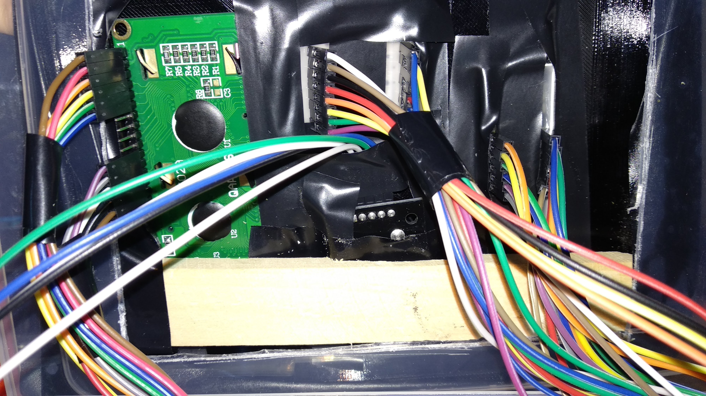

# Santa's Workshop

## Summary

"Santa's Workshop" is a 2D scrolling platformer, inspired by classic games such as Mario. The player is represented by a dot which is able to move and jump around the map. The map is made out of horizontal platforms.

[Click here for a video presentation of the game](https://www.youtube.com/watch?v=GFQkmgMiz-4)

## Story

While working hard to make presents for Christmas, the elves were careless and misplaced some toys in the workshop.
Your objective is to jump around and collect all the presents before Santa has to depart to deliver the presents.

Each level is a different room of Santa's Workshop, each more intricate than the previous one. And because Christmas is fast approaching, you will start with less time in later levels.

## How To Play

The primary method to control the game is through the joystick.

### In the menu

The menus can be navigated using the joystick (left/right/up/down). **Pressing** the joystick will **activate** the currently selected item.

### During the game

Moving the joystick **left** and **right** makes the player's dot **move**.
Moving the joystick **up** is used for **jumping**.

**Pressing** the joystick **pauses** the game. Another press will unpause it.

The objective is to jump and climb up the platforms higher and higher.
Along the way, you can collect gifts (the flashing dots) for points and extra time.

If you fall and die, you will be respawned on the platform you were last sitting on.

## Design

This section describes how this game satisfies the project's requirements.

### Hardware

#### Display / Output

- The game menu and messages are displayed on an **LCD display**.

- The map is displayed on a scrolling **8x8 LED matrix** driven by a **MAX7219 driver**

- The driver is chained to another one which drives a **four digit 7-segment display**,
  which will be used to display the **time remaining** in the level.

- **Buzzer** is used to generate simple tones when player collects a present, when time runs out, etc.

#### Input

- Primary input is through the **joystick**. The player can **move** around **left** and **right** and can **press** the joystick to **jump**.

- Possibly add a **switch** for turning game on or off.

### Scoring

- Player's **score** depends on the **biggest height they reached**
  and **how many presents they collect**.

  On harder difficulties, the score receives a **multiplier**.
  Also, any extra lives or time left at the end is added to the score.

- The high score is _saved_ along with the player's name in the **EEPROM**.
  When the game ends, the player is shown their final score, and informed
  if they got a new high score.

- The player has a **limited time** to collect the presents.
  They get **extra time** from collecting gifts.
  If they fall they **lose precious time**.

## Implementation

This section contains the tehnical details of the final project.

### Hardware

### File Hierarchy

What follows is an overview of the files and classes used to program the game.

- [MatrixGame.ino](MatrixGame.ino) contains the `setup()` and `loop()` entry points.

- Game [states](State.h):

  - [Intro screen](IntroState.h)
  - Menus:
    - [Start Menu](StartMenuState.h)
    - [About Menu](AboutMenuState.h)
    - [High Scores Menu](HighScoreMenuState.h)
    - [Settings Menu](SettingsMenuState.h)
  - [Playing state](PlayingState.h)
  - [Game over screen](GameOverState.h)

- [Hardware](Hardware.h)

  - [Joystick](Joystick.h)
  - [8x8 Matrix](Matrix.h)
  - Time left, shown on a [7-segment display](TimeDisplay.h)

- Music system

  - Note [pitches](Pitches.h)
  - [Melodies](Melody.h)
  - [Melody player](MelodyPlayer.h)

- Game world

  - [Player](Player.h)
  - [Map](Map.h)
  - [Score](Score.h)

- [Persistent data](Persistent.h), saved to the EEPROM

- All the configurable [settings](Settings.h)

- [Time](Time.h)-related and [utility](Utility.h) functions
